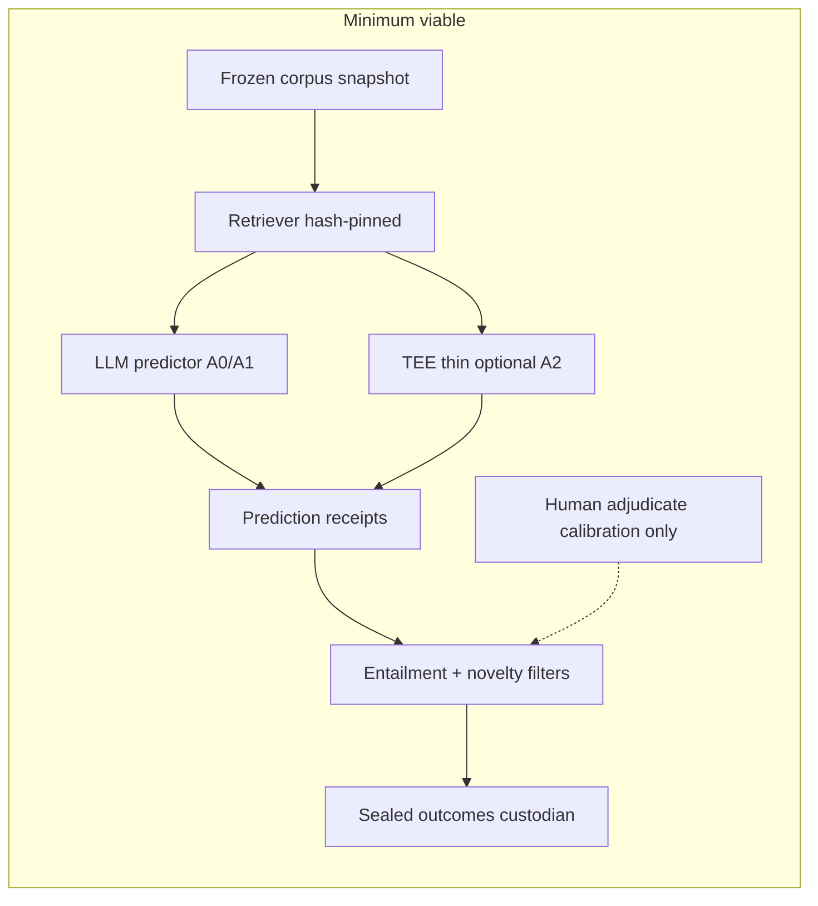

# TEE Scientific Audit — Q14–Q20

**Auditor:** Independent executor (gh API + shallow sparse clone under `/workspace/tee-audit`)  
**Repository:** `prateekm1007/technology-evolution-engine`  
**Audit date:** 2026-08-13 (Asia/Calcutta)  
**Main tip inspected:** `151cf0f23469` (2026-08-12 ~21:39 UTC / 2026-08-13 03:09 IST)  
**Method:** `gh api` trees/contents/commits; recomputation from raw JSON receipts/scores; sparse clone of `discovery_fabric/`, `independent_corpus/`, key root manifests. **Did not** treat V1.x reports, README, RESEARCH_TRUTH, or FINAL_* as authority.

**Critical git fact:** `gh compare main...<other-branch>` returns *No common ancestor* for all four non-main branches. Histories were rewritten/orphaned. Cross-branch “lineage” claims are not verifiable from merge-base.

---

## 1. Inventory of ALL branches (purpose from contents/commits)

| Branch | Tip SHA | Blobs (approx) | One-line purpose (from commits + contents) |
|---|---|---|---|
| **main** (default) | `151cf0f23469` | ~4702 | Active scientific program: Discovery Fabric + DSB V1 adjudication/security forensics + RESEARCH_TRUTH inventory; latest work is AI-CTO adjudication recording and quarantine enforcement, not new discovery architecture. |
| **independent-scientific-corpus-construction-75b04** | `742cf207f389` | ~12007 | Orphan branch that added `tee-independent-scientific-corpus/` “3900-source” corpus scaffolding; **manifest explicitly notes mock data**; provenance claims “verified” while notes say replace with real API data. |
| **external-review-preparation** | `b585e60a5521` | ~2552 | B-2 / GLiREL relation-extraction engineering track + automated held-out pipeline; tip commit: sealed held-out artifact **NOT FOUND**; GLiREL-large decision gate **STOP** (relation precision worsened). |
| **held-out-sealed-20260809** | `9f84b4252547` | ~2342 | Seal of B-2 held-out adversarial set: `SEAL_MANIFEST.json` only (hashes + metadata); ciphertext not present in tree; precedes external-review “NOT FOUND”. |
| **audit/forensic-review** | `aacd9e44152e` | ~285 | Early forensic audit of invention-compiler stack (F-AUD-001..012): correctness/honesty fixes + audit-loop meta; predates Discovery Fabric / DSB era. |

---

## 2. North Star / central thesis (from code + experiments, not marketing)

**Operational North Star encoded in experiment design** (DSB arms, ablation configs, Gate 2 DPS, prospective infra comments):

> Can a structured pipeline (mechanism extraction → constraints → combination/transfer → calibrated prompts / “full system”) produce **independently novel, retrieval-negative, adversarially surviving, falsifiable** scientific hypotheses at a **materially higher rate** than **frontier LLM (+ retrieval) controls**?

**What the code actually implements today:**
- LLM-prompted “discovery engines” v1–v4 (`discovery_fabric/discovery_modes/discovery_engine*.py`) that wrap OpenRouter/LLM calls with mechanism/constraint scaffolding.
- Historical **reconstruction** benchmarks on famous discoveries (CRISPR, mRNA, Li-ion, PCR, …).
- A blinded DSB V1 (10 real + 10 fabricated × 4 arms = 80 receipts) with deterministic structure/mechanism scorers.
- Heavy governance, freeze manifests, adjudication engines V1–V8.1 — mostly **measurement theater** after discovery signal failed.

**Empirically, under the repo’s own strongest controls, that thesis is currently UNPROVEN and the architecture contribution looks null-to-negative.**

---

## 3. Contamination risks & what could NOT be independently verified

### Contamination / invalidation risks (confirmed or strongly supported)

1. **Famous-discovery reconstruction leakage:** Ablation/V1.11 cases are culturally ubiquitous (CRISPR, mRNA, PCR…). LLM-only strict recovery **28/30 (93%)** in `ablation_v2_results.json` — architecture “wins” are not discovery.
2. **Scorer gaming / scorer-as-signal:** V1.11–V1.12 used V2 scorer claiming ~96% vs 20% LLM-only; V3 later collapsed advantage to ~4pp; false-discovery control hit **60%** under V2 (`V1_12_VALIDATION_REPORT.md` + frozen results). Measuring scorer quirks, not discovery.
3. **Exit-gate contamination:** `discovery_fabric/dsb_v1/audit/exit_gate_report.json` marks **E5_HUMAN_ADJUDICATION `passed: true`** while `adjudication_performed: false`. Overall `overall_pass: true` / 6/6 is **FALSE as a scientific closure claim**.
4. **Mock / missing corpora:** Independent-corpus branch manifest: `"notes": "Mock data generated for infrastructure testing..."` with `source_count: 3900`. Separate 3,210 corpus: empty dirs / hash not found (`CORPUS_FREEZE_RECONCILIATION_V1.md`, `CORPUS_ARTIFACT_LOCATION_AUDIT_V1.md` on main).
5. **Held-out seal without ciphertext:** `held-out-sealed-20260809` has `SEAL_MANIFEST.json` (`ciphertext_sha256=319de3cf…`); `external-review-preparation` tip cannot find artifact — held-out B-2 evaluation **not executed**.
6. **AI-CTO ≠ human:** Adjudication findings explicitly `evidence_tier: AI_CTO_ADJUDICATION`, `independent_human_validation: NOT PERFORMED` (`CTO_ADJUDICATION_FINDINGS_VERIFIED.json`).
7. **Orphan branch histories:** No merge-base with main → cannot trust that “pre-main B-2” artifacts are ancestral to main’s DSB path.
8. **Absolute host paths in receipts** (`/home/z/my-project/...`) — reproducibility depends on external machines/API backends (`z-ai-cli-glm-4-plus`, OpenRouter) not present here.
9. **Relation extraction failure:** GLiREL-large relation precision **0.8%** (gold ~1.2%) with STOP decision — any graph-built-from-extraction path is poisoned upstream.

### Could NOT independently verify

- Live LLM regeneration of the 80 DSB receipts (API/cost; receipts treated as frozen artifacts).
- Human expert adjudication of DSB packets (not performed).
- Decrypt/evaluate sealed B-2 held-out set (ciphertext absent from accessible trees).
- That the 112 “eligible” OpenAlex sources’ full texts/abstracts were actually used in any discovery run that beat controls (registry exists; discovery advantage does not).
- Prospective experiment end-to-end (infra claimed; **not run** — consistent with quarantine docs and absence of prospective result artifacts).
- 1 of 111 freeze paths missing locally: `adjudication/adjudication_packets_BLIND.json` (110/111 SHA-256 OK).
- Per-packet sealed CTO ledger comparison (status PENDING in confirmation JSON).

### Independently recomputed (authoritative for this audit)

| Check | Artifact | Result |
|---|---|---|
| DSB structure recoveries | `discovery_fabric/dsb_v1/scores/scores.json` @ main `151cf0f` | **13/80** RECOVERED (fab **10**, real **3**) |
| DSB mechanism ≥0.50 | same | **0/80** |
| DSB by arm (structure) | same | LLM_only **3/20**, combination **6/20**, mechanism_only **2/20**, **full_system 2/20** |
| Receipt integrity flags | same | 80/80 `receipt_integrity_ok` |
| Freeze hashes | `FREEZE_MANIFEST.json` | **110/111** match; 1 missing path |
| Ablation V2 totals | `.../ablation_v2_results.json` | C_mechanism **30/30**; F_full **19/30 (63.3%)**; B_llm_only **28/30**; advantage_pp **-2.9** |
| Matched McNemar | `matched_case_analysis.json` + `forensic_audit.json` | 18 matched; χ²=**0.5**; C better than F on 2, F better 0 |
| Gate 2 DPS | `v1_13_gate2/results.json` | **total_DPS_1 = 0**; all arms 0% |
| Gate 1 forensic DPS | `v1_13_forensic/results.json` | **3/40** DPS=1 (incl. D_random=1, F_full=2) |
| V1.11 raw | `benchmark_results_v1_11.json` | reports **49/50 (98%)** strict — conflicts with narrative “48/50 (96%)” |
| GLiREL-large | branch `external-review-preparation` `final_report.json` | rel-P **0.8%**, decision **STOP** |
| 112 corpus registry | `final_eligible_source_universe_v1.json` | **source_count=112**, len(sources)=112 |
| Mock 3900 corpus | branch indep `CORPUS_MANIFEST.json` | mock note + 3900 claimed |

---

## 14. What should be deleted?

Delete or quarantine permanently (complexity without demonstrated discovery value):

### A. Failed / superseded discovery stacks
- `discovery_fabric/discovery_modes/discovery_engine.py` … `_v4.py` as **product** paths (keep only as cemetery samples if needed).
- Combination / value / funding simulation layers that produced V1.7–V1.8 “100% survival” under self-calibrated attack criteria (`combinations/`, discovery value scorers tied to those reports).
- `invention_compiler/` knowledge modules that are docstring/dict “science” (physics/chemistry/math “encoded principles”) — early audit already flagged honesty failure; no DSB/ablation advantage.
- Parallel Gen1–Gen5 PR score theater in `benchmarks/reports/gen*_pr_score.json` as capability claims (extraction F1 ≠ discovery).
- `engine/checkpoint.py` mega-module and product/UI commercialization surfaces until a decisive experiment passes.

### B. Invalidated experiments & inflated metrics (archive, do not cite)
- V1.7–V1.11 positive discovery claims; V1.12 “76pp architecture advantage”; V3 “90pp gap” as architecture proof.
- DSM / LLM-proxy human-adjudication substitutes as primary metrics (repo already retired DSM; enforce deletion from dashboards).
- Broad-range V1.13 original evaluator; Gate 1 DPS as success metric (range-fitting).
- Discovery Capability F1=0.5714 bridge-matcher scores where FP floor ~0.92 historically documented — not a discovery metric.
- Mock 3900 corpus tree on `independent-scientific-corpus-construction-75b04`; empty 3210 corpus claims.

### C. Governance / adjudication bureaucracy beyond measurement minimum
- Adjudication engines V1→V8.1 security forensics **as blockers to running the decisive experiment** (keep one freeze+hash tool; delete iterative “deployment isolation” theater until there is a positive scientific signal to protect).
- Duplicate FINAL_*/RESEARCH_TRUTH*/scorecard regenerators that create a second “truth” layer over raw JSON.

### D. Extraction path that failed decision gate
- GLiREL/GLiDRE/Relex “evidence-injection improves discovery” line (`b2_glirel_experiment` results: STOP). Do not keep as active substrate.

**Keep (narrow):** DSB case schema + frozen receipts/scores; Gate 2 entailment ideas; 112-source eligibility registry; B-2 leakage detector design docs; prospective experiment skeleton; CONSTITUTION honesty rules.

---

## 15. What should NOT be built?

Refuse these next features given current evidence:

1. **Any new architecture module** (temporal reasoning, negative knowledge graph, patent integration, L6 search, “Discovery Fabric v5”) before a prospective win — already prohibited in freeze policy; evidence supports the ban.
2. **Scorer tuning on the frozen 80 DSB cases** — classic leakage; protocol correctly forbids; do not “fix” fabricated>real by retuning.
3. **Another retrospective famous-discovery benchmark** with LLM judges or fuzzy mechanism matchers.
4. **Larger mechanism graphs / more combination modes** — ablation shows more scaffolding → worse or equal (F_full 63% total-denom vs C_mechanism 100% reconstruction; DSB full_system worst/tied).
5. **Product, UI, commercialization, funding simulators** — STOP_BUILDING already; science gate not passed.
6. **Multi-identity cryptographic adjudication deployment** as a substitute for running the decisive experiment.
7. **Replacing GLiREL with a bigger extractor** hoping relation precision magically unlocks discovery — large model was worse.
8. **Mock corpora “frozen” as scientific assets.**
9. **AI-CTO adjudication counted as human validation.**
10. **Rebuilding invention_compiler vertical slice** until baseline LLM+retrieval prospective protocol is defined and failed/succeeded.

---

## 16. The decisive experiment

**Name:** Prospective Sealed Cross-Domain Prediction Contest (PSCD-1)

**Design (hard to game by coder or model):**

1. **Custodian (not implementer)** samples N≥50 paper-pairs from a corpus frozen **before** any TEE hypothesis exists; publication cutoff T0; domains disjoint; abstracts+methods only.
2. **Seal** answer keys: later observed outcomes (T0+Δ papers, patents, or registered clinical/engineering results) encrypted; ciphertext hash published; key withheld until submission freeze.
3. **Arms (identical budget, tools, retrieval corpus snapshot):**
   - A0: frontier LLM alone  
   - A1: frontier LLM + same retrieval index  
   - A2: TEE minimal (only components that survive deletion list)  
   - A3: optional — random/hypothesis-noise control  
4. Each arm emits ≤K falsifiable, quantitative predictions **before** key release; hash-commit predictions.
5. **Primary endpoint (pre-registered):** rate of **retrieval-negative + non-entailed + later-confirmed** predictions (strict point/tolerance), minus false alarms on fabricated foil pairs mixed in.
6. **Success:** A2 ≥ A1 + δ (pre-register δ, e.g. +10pp absolute) with bootstrap CI excluding 0; and fabricated foil rate ≤ ε.
7. **Anti-game rules:** no scorer trained on these cases; no human in generation loop; model/date freeze; retrieval snapshot hash; coder cannot touch sealed keys (separate identity — only after protocol works, not before).

**Why this is decisive:** It asks for **future-confirmable novelty under sealed outcomes**, not reconstruction of CRISPR. Matches the North Star. DSB already showed structure≠novelty (CTO Q3 YES=0/80); this forces the novelty+confirmation conjunction.

---

## 17. The decisive failure test

**Name:** Architecture Increment Null Test (AINT-1) — can be run cheaper than PSCD-1 and already nearly failed.

**Protocol:** On the **same** prospective sealed set (or a smaller N≥30 pilot with sealed foil outcomes):

- Compare A1 (LLM+retrieval) vs A2 (full current Fabric: mechanisms+constraints+combination+full prompts) under identical retrieval.
- Pre-register: if A2 − A1 ≤ 0 on primary endpoint (and not explained by compute underspend), **reject the architectural hypothesis** that structured Fabric layers add discovery value.

**Already-observed near-failure (retrospective, contaminated but directionally consistent):**
- Ablation V2: F_full **worse** than C_mechanism / ≈ LLM-only (`architecture_advantage_pp: -2.9`; McNemar χ²=0.5).
- DSB V1: full_system structure recovery **2/20** vs combination **6/20** vs LLM_only **3/20**; mechanism reconstruction **0/80**; AI-CTO novelty YES **0/80**.

**If AINT-1 fails prospectively:** simplify to LLM+retrieval (+ thin logging) or abandon Fabric representation — do **not** add modules.

**Abandon discovery thesis (D) only if:** PSCD-1 shows **no arm** (including strong LLM+retrieval) beats chance/foils on sealed confirmations after adequate power — i.e., the *goal* is infeasible with current science/compute, not merely that Fabric lost.

---

## 18. Code vs claims (V1.1–V1.12 major claims)

Classification key: **PROVEN** (reproduced here from raw artifacts) / **SUPPORTED** (consistent evidence, minor gaps) / **UNPROVEN** / **FALSE** / **INVALID EXPERIMENT**.

| Version | Major claim | Class | Exact artifact |
|---|---|---|---|
| V1.1–V1.3 | Early adversarial audits / fabric baselines | **SUPPORTED** (process) | `discovery_fabric/reports/DISCOVERY_ENGINE_AUDIT_V1*.md`, `baselines/V1_2_FAILURE_BASELINE/` |
| V1.4 | “Preliminary discovery signal” (1 real survived attack) | **INVALID EXPERIMENT** | `DISCOVERY_ENGINE_V1_4_REPORT.md` — n=1; no blind historical; attack not independent of authors |
| V1.5 | Discovery Fabric does not outperform baselines (0% all) | **SUPPORTED** | `DISCOVERY_ENGINE_V1_5_VALIDATION_REPORT.md` |
| V1.1–V1.6 | Evidence-injection (GLiREL etc.) improves discovery | **FALSE** | `external-review-preparation` `.../glirel_large/final_report.json` STOP; rel-P 0.8% |
| V1.1–V1.6 | B-2 leakage instrument useful | **SUPPORTED** (as instrument design) | B-2 design docs + held-out seal manifest; **held-out run not completed** |
| V1.1–V1.6 | Custodian infra sound | **SUPPORTED** (schemas/registry exist) | `custodian/`, 112-source universe JSON |
| V1.1–V1.6 | 112-source corpus frozen usable | **SUPPORTED** (registry) / **UNPROVEN** (as discovery substrate) | `independent_corpus/reports/final_eligible_source_universe_v1.json` (112) |
| V1.1–V1.6 | 3900-source corpus real | **FALSE** | indep branch `CORPUS_MANIFEST.json` mock note |
| V1.1–V1.6 | 3210-source corpus exists | **FALSE** | `CORPUS_FREEZE_RECONCILIATION_V1.md`, `CORPUS_ARTIFACT_LOCATION_AUDIT_V1.md` |
| V1.6 | Pattern coverage 40%; needs combination mode | **UNPROVEN** (taxonomy hand-labeled) | `DISCOVERY_ENGINE_V1_6_REPORT.md` |
| V1.7 | Combination engine + calibrated survival → discovery signal; 4/4 survive; 100% vs LLM 0% | **INVALID EXPERIMENT** | `DISCOVERY_ENGINE_V1_7_REPORT.md` — calibrated criteria + tiny n; later ablations refute architecture value |
| V1.8 | Discovery value + funding sim calibration signal | **INVALID EXPERIMENT** | `DISCOVERY_ENGINE_V1_8_CALIBRATION_REPORT.md` — n=4; circular value model |
| V1.9 | Historical backtest 2/5 found | **SUPPORTED** as **reconstruction rate only** | `DISCOVERY_ENGINE_V1_9_VALIDATION_REPORT.md`; not novelty |
| V1.10 | Expanded 50-discovery + V2 scorer valid | **FALSE** / **INVALID EXPERIMENT** | V2 later shown lenient on false discoveries (60%) in V1.12 controls |
| V1.11 | 96% strict recovery (48/50) | **FALSE** as discovery; raw file says **49/50 (98%)** | `evaluation/historical_backtest/benchmark_results_v1_11.json`; claim ≠ file; famous-case leakage |
| V1.12 | Architecture +76pp over LLM-only (96% vs 20%) | **FALSE** | `reports/V1_12_VALIDATION_REPORT.md` claim; contradicted by V3 + ablation_v2 |
| V1.12 | V3: 90pp gap (real 90% vs false 0%) proves architecture | **INVALID EXPERIMENT** | `V1_12_FINAL_VALIDATION_REPORT.md` itself corrects: gap vs LLM-only ~4pp; famous-case reconstruction |
| V1.12 | Honest correction: ~4pp architecture advantage | **FALSE** as lasting claim | `ablation_v2_results.json` advantage_pp **-2.9**; F_full 19/30 |
| V1.12 | Ablation V2: architecture does not add value; C_mechanism best; F_full worst (~63%) | **PROVEN** | `.../ablation_v2_results.json` (recomputed total-denom) |
| V1.12 | Matched-case McNemar 0.50; 18 matched / 150 records | **PROVEN** | `matched_case_analysis.json`, `forensic_audit.json` |
| V1.12 | Generator input isolation 0/50 leaked | **SUPPORTED** | `generator_input_audit.json` (not fully re-derived here; file present) |
| V1.12 | Old DSB 30-case complete/valid | **INVALID EXPERIMENT** | superseded; LLM-proxy adjudication |
| V1.12 | Formal rubric / DSM thresholds failed; DSM retired | **SUPPORTED** | human_adjudication reports under `evaluation/v1_12_controls/` |
| V1.13* | 30–40% CORRECT via broad range | **FALSE** / **INVALID EXPERIMENT** | `v1_13/results.json` ~35% CORRECT; Gate2 shows 0 DPS=1 |
| V1.13* | Gate1 7.5% DPS=1 (3/40) | **PROVEN** as machine score; **INVALID** as discovery | `v1_13_forensic/results.json` (includes random arm DPS) |
| V1.13* | Gate2 0/40 DPS=1 | **PROVEN** | `v1_13_gate2/results.json` |
| DSB V1 | Exit gate 6/6 PASS | **FALSE** | `audit/exit_gate_report.json` E5 passed without human adjudication |
| DSB V1 | 13/80 structure; 0/80 mechanism; fab>real; no full_system advantage | **PROVEN** (machine) | `scores/scores.json` recomputed |
| DSB V1 | Novelty established / North Star proven | **UNPROVEN** (AI-CTO Q3 YES=0/80 is negative machine/AI evidence only) | `CTO_ADJUDICATION_FINDINGS_VERIFIED.json` |

\*V1.13 included because it closes the V1.12 claim chain; user asked V1.1–V1.12 primarily.

---

## 19. North Star architecture (minimum that could plausibly work)

**Survive:**
- Frozen external corpus + eligibility registry (real sources only).
- Retrieval index with snapshot hashing.
- Prediction object schema: mechanism claim, quantitative forecast, falsifier, evidence IDs, retrieval-negative attestation.
- Sealed outcome custodian workflow (held-out pattern — but **with ciphertext actually stored**).
- Deterministic entailment / novelty checks (Gate 2 spirit) + human adjudication on a calibration set **disjoint** from scored test.
- Simple arm runner + receipt hashing (DSB receipt discipline).

**Remove:**
- Multi-version discovery_engine_vN, invention_compiler “science modules”, value/funding simulators, Gen scorecards as KPIs, GLiREL substrate, adjudication deployment theater, mock corpora, retrospective famous-discovery leaderboards.

**Architectural hypothesis retained only as A2 optional adapter**, not as the product center. Default center = A1 (LLM+retrieval) until AINT-1/PSCD-1 say otherwise.

---

## 20. Final verdict

### **B — Simplify radically**

**Evidence:**
1. Recomputed DSB: **full_system underperforms** combination/LLM_only on structure recovery; **0/80** mechanism reconstruction (`scores/scores.json`, main `151cf0f`).
2. Recomputed ablation V2: F_full **19/30 (63%)** vs C_mechanism **30/30** vs LLM-only **28/30**; McNemar χ²=0.5 (`ablation_v2_results.json`, `forensic_audit.json`).
3. Gate 2: **0/40 DPS=1** (`v1_13_gate2/results.json`) — retrospective path exhausted without architecture win.
4. GLiREL STOP: relation precision **~1%** (`external-review-preparation` final_report) — graph substrate not ready.
5. Positive V1.7–V1.12 discovery/advantage claims collapse under controls → continuing architecture (A) repeats invalidated design.
6. Not **D**: prospective sealed test not run; LLM+retrieval baseline not shown incapable of North Star.
7. Not **C** yet: rebuilding a *different* heavy representation before a simplified baseline wins PSCD-1 repeats the complexity failure mode.

**Action implied by B:** Delete Fabric/invention-compiler complexity; keep corpus+retrieval+receipt+seal; run AINT-1/PSCD-1; only then consider a new representation (C) if A1 wins but still insufficient for ambition.

---

## V1.x report files found (and branch)

All of the following are on **main** @ `151cf0f` under `discovery_fabric/` unless noted. Non-main branches do **not** carry the Discovery Fabric V1.4–V1.12 report series (orphan early trees).

| File | Branch |
|---|---|
| `discovery_fabric/reports/DISCOVERY_ENGINE_AUDIT_V1.md` | main |
| `discovery_fabric/reports/DISCOVERY_ENGINE_AUDIT_V1_2.md` | main |
| `discovery_fabric/reports/DISCOVERY_ENGINE_AUDIT_V1_3.md` | main |
| `discovery_fabric/reports/DISCOVERY_ENGINE_V1_4_REPORT.md` | main |
| `discovery_fabric/reports/DISCOVERY_ENGINE_V1_5_VALIDATION_REPORT.md` | main |
| `discovery_fabric/reports/DISCOVERY_ENGINE_V1_6_REPORT.md` | main |
| `discovery_fabric/reports/DISCOVERY_ENGINE_V1_7_REPORT.md` | main |
| `discovery_fabric/reports/DISCOVERY_ENGINE_V1_8_CALIBRATION_REPORT.md` | main |
| `discovery_fabric/reports/DISCOVERY_ENGINE_V1_9_VALIDATION_REPORT.md` | main |
| `discovery_fabric/evaluation/historical_backtest/V1_11_VALIDATION_SEAL.md` | main |
| `discovery_fabric/reports/V1_12_VALIDATION_REPORT.md` | main |
| `discovery_fabric/reports/V1_12_FINAL_VALIDATION_REPORT.md` | main |
| `discovery_fabric/experiments/V1_12_COMPLETE_FROZEN/V1_12_FINAL_VALIDATION_REPORT.md` | main |
| `discovery_fabric/experiments/V1_12_COMPLETE_FROZEN/V1_12_VALIDATION_REPORT.md` | main |
| `discovery_fabric/v1_13_forensic/V1_13_FORENSIC_CORRECTION_REPORT.md` | main (post-V1.12) |
| `discovery_fabric/v1_13_gate2/V1_13_GATE2_REPORT.md` | main |
| `discovery_fabric/v1_13_postmortem/V1.13_RETROSPECTIVE_BENCHMARK_POSTMORTEM.md` | main |
| `discovery_fabric/dsb_v1/DSB_V1_REPORT.md` | main |
| `discovery_fabric/reports/MILESTONE_REPORT_V1.md` | main |

**Related root V1 audit docs on main:** `CORPUS_*_V1.md`, `FORENSIC_RECONCILIATION_V1.md`, `FREEZE_CHAIN_INTEGRITY_REPORT_V1.md`, `RESEARCH_TRUTH*.md` (meta; not treated as authority).

**Branch-local (not V1.4–V1.12 discovery reports):** GLiREL hybrid FINAL_* reports on `external-review-preparation`; `SEAL_MANIFEST.json` on `held-out-sealed-20260809`; `AUDIT.md` on `audit/forensic-review`.

---

## Appendix — Arm recovery table (DSB V1, recomputed)

| Arm | Structure RECOVERED | Mechanism RECONSTRUCTED |
|---|---|---|
| LLM_only | 3/20 | 0/20 |
| mechanism_only | 2/20 | 0/20 |
| combination | 6/20 | 0/20 |
| full_system | 2/20 | 0/20 |
| **Total** | **13/80** (10 fab + 3 real) | **0/80** |

---

*End of audit. Path: `/workspace/TEE_SCIENTIFIC_AUDIT_Q14_Q20.md`*
