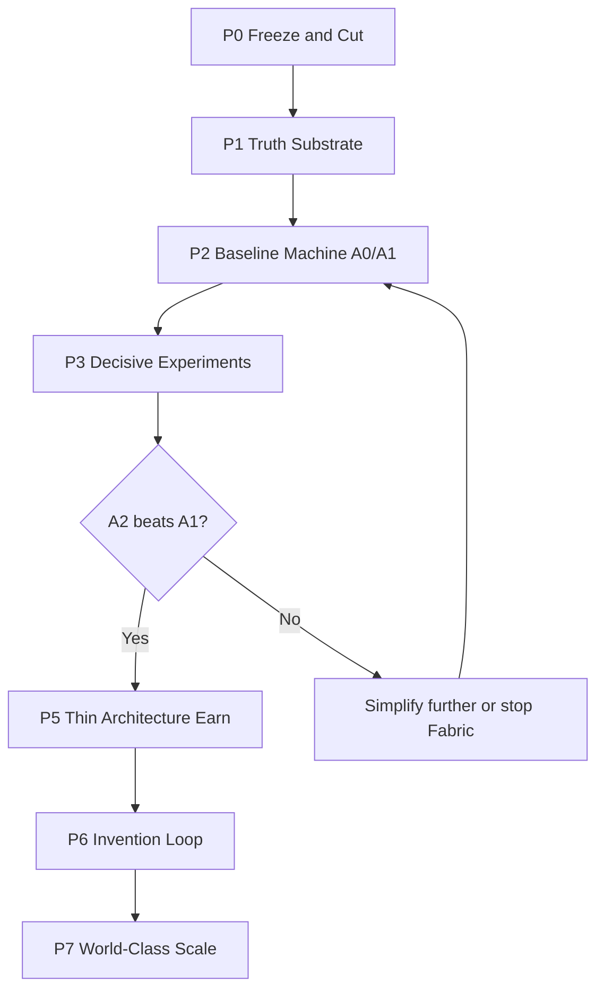

# World-Class Discovery & Invention Roadmap

**Repo:** `prateekm1007/technology-evolution-engine`  
**Base:** `main` @ ~2026-08-12 (post DSB / V8.1 adjudication)  
**Supersedes for strategy:** `ROADMAP_V2.md` Programs B–E product expansion, and any plan that adds Fabric modules before a prospective win  
**Grounding:** Scientific audit Q14–Q20 (verdict **B — Simplify radically**)  
**North Star:** A system that produces **independently novel, retrieval-negative, falsifiable, later-confirmed** scientific/engineering hypotheses at a **materially higher rate** than frontier LLM + retrieval — then turns the winners into inventions with external validation.

---

## 0. Where we are (honest, from `main`)

| Layer | Reality on `main` |
|---|---|
| **Thesis** | Structured Discovery Fabric beats LLM(+retrieval) on real discovery — **UNPROVEN**; strongest controls show **null-to-negative** architecture contribution |
| **DSB V1** | 13/80 structure recoveries (10 fabricated / 3 real); **0/80** mechanism reconstruction; `full_system` does not win |
| **Ablation V2** | F_full **19/30** vs LLM-only **28/30** vs C_mechanism **30/30**; advantage **−2.9pp** |
| **Gate 2 / V1.13** | **0/40** DPS=1 under strict entailment |
| **Extraction (other branches)** | GLiREL relation path **STOP**; held-out ciphertext **missing** |
| **Corpora** | 112-source eligibility registry usable; mock/empty “thousands of sources” claims are not assets |
| **Governance** | Freeze/hash/receipt discipline is valuable; adjudication V1–V8.1 and exit-gate “PASS without human” are not science |
| **Invention** | Schemas and loops exist; **no** credible invention evidence; product/UI correctly frozen |
| **STOP_BUILDING** | Correct instinct (no product, no score gaming) — but “finish Programs A–D metrology first” must not become infinite theater |

**Implication:** We are **not** one module away from world-class. We are at a **scientific fork**: keep building complexity, or shrink to a machine that can run a decisive contest.

---

## 1. Where we want to be

### Definition of “world-class discovery & invention machine”

A system is world-class when **all** of the following are true for ≥2 disjoint domains:

1. **Prospective discovery rate:** On sealed, pre-registered contests, TEE thin stack beats LLM+retrieval by a pre-registered margin on *retrieval-negative + later-confirmed* predictions (with controlled false-alarm rate on foils).
2. **Independent novelty:** Human experts (not AI-CTO) accept a non-trivial fraction as non-obvious and non-entailed by the frozen corpus.
3. **Falsifiability ops:** Every promoted claim carries quantitative prediction + kill criteria + evidence IDs.
4. **Invention bridge:** At least some confirmed discoveries convert to invention candidates with experiment designs that **external labs or partners** can run (or have run).
5. **Anti-contamination:** Scorers, judges, and corpora used for claiming wins were frozen *before* generation; no famous-case reconstruction counted as discovery.

Until (1)–(3) are met, we do **not** claim discovery. Until (4) is met, we do **not** claim invention. Until (5) is met, we do **not** publish win rates.

### Non-goals (explicit)

- Beating reconstruction benchmarks on CRISPR / mRNA / PCR-class cases
- Growing module count, adjudication engine versions, or report volume
- Product, UI, funding simulators, or commercialization before Gate D (below)
- Treating AI adjudication as human validation

---

## 2. Strategy (one sentence)

**Cut the stack to corpus + retrieval + receipts + sealed evaluation; establish an honest LLM+retrieval baseline; only then earn the right to add structure — and only the structure that wins AINT/PSCD.**

---

## 3. Phased roadmap

### Phase 0 — Freeze & Cut (1–2 weeks)

**Goal:** Stop digging. Make `main` a scientific instrument, not a museum.

| Work | Done when |
|---|---|
| Declare scientific freeze: no new discovery_engine / Fabric modules / invention features | Written policy + CI deny list updated |
| Quarantine (don’t delete history): engines v1–v4, invention_compiler science theater, value/funding sims, Gen PR scorecards as KPIs, GLiREL active path, mock 3900 corpus references | Paths moved under `cemetery/` or flagged `INVALID_AS_EVIDENCE` |
| Keep: DSB receipts/scores (as negative assets), 112-source registry, freeze+hash tooling, Gate-2 entailment ideas, prospective skeleton, CONSTITUTION honesty rules | Explicit KEEP list in repo |
| Invalidate false closure: flip E5 / overall_pass semantics so “human pending” ≠ PASS | One PR; tests |
| Single source of strategic truth: this roadmap + audit; demote V1.7–V1.12 advantage claims | `RESEARCH_TRUTH` points at raw JSON + this doc |

**Exit:** `main` cannot claim architecture win; STOP_BUILDING forbids new modules until Phase 3 pass.

---

### Phase 1 — Truth Substrate (2–4 weeks)

**Goal:** Assets that cannot lie.

| Work | Done when |
|---|---|
| **Corpus v1 (real only):** freeze the 112-eligible universe (or a documented superseding real set); store abstracts/fulltext hashes; no mock fillers | Manifest: count, hashes, license, cutoff date |
| **Retrieval snapshot:** one index pinned by content hash; same for all arms | `retrieval_snapshot_sha256` in every receipt |
| **Prediction object schema (canonical):** claim, quantitative forecast, tolerance, falsifier, evidence IDs, retrieval-negative attestation, model+prompt hashes | Schema + validators; used by all arms |
| **Custodian role:** separate identity/process for sealed keys (even if same human with ceremony) | Runbook; keys never on builder machine |
| **Repair held-out pattern:** if B-2 ciphertext is gone, **re-seal** a new held-out set; never claim a seal without artifact | Ciphertext + manifest both in durable storage |

**Exit:** Can run a blind contest end-to-end on dry-run foils without touching Fabric engines.

---

### Phase 2 — Baseline Machine (A0 / A1) (3–6 weeks)

**Goal:** A boring, excellent LLM(+retrieval) discovery loop — the thing Fabric must beat.

| Arm | Definition |
|---|---|
| **A0** | Frontier LLM alone, fixed model/date, fixed prompt family |
| **A1** | Same LLM + Phase-1 retrieval snapshot only |

| Work | Done when |
|---|---|
| Arm runners emit Phase-1 receipts only (no Fabric scaffolding) | CI green on dry-run |
| Budget parity rules (tokens, tool calls, wall time) | Written + enforced in runner |
| Calibration set (small, **disjoint** from test): human labels for entailment/novelty language | N≥20 dual-annotated |
| Foil generator: fabricated paper-pairs that must not “confirm” | Foil rate measurable |

**Exit:** A0/A1 produce hash-committed prediction batches against a dry-run sealed set; humans can score a sample without seeing arm labels.

---

### Phase 3 — Decisive Experiments (4–8 weeks, can overlap late Phase 2)

**These are the only gates that unlock architecture work.**

#### Gate A — AINT-1 (Architecture Increment Null Test)

- Same sealed prospective (or sealed foil) set for A1 vs **A2** (current Fabric: mechanisms+constraints+combination+full prompts), identical retrieval.
- Pre-register: if A2 − A1 ≤ 0 on primary endpoint → **reject Fabric hypothesis**; stay on A1; do not add modules.
- Primary endpoint: rate of retrieval-negative + non-entailed + (when unsealed) confirmed predictions, minus foil false alarms.

#### Gate B — PSCD-1 (Prospective Sealed Cross-Domain Prediction Contest)

- N≥50 pairs (or powered N from pre-reg); domains disjoint; cutoff T0; answers sealed until submission freeze.
- Arms: A0, A1, A2 (only if AINT not already fatal), A3 noise/random control.
- Success for “architecture earns keep”: A2 ≥ A1 + δ (pre-register δ, e.g. +10pp) with CI excluding 0; foil rate ≤ ε.
- Success for “discovery thesis lives”: **some** arm (likely A1) beats chance/foils on later confirmation — else reconsider ambition (audit option D), not just representation.

**Exit:**

| Outcome | Next |
|---|---|
| A2 ≤ A1 | **Fabric retired**; roadmap continues on A1 → Phase 6 with thin logging only |
| A2 > A1 by δ | Phase 5: keep **only** the components ablation credits |
| No arm beats foils | Pause discovery claims; diagnose task design / power / domain before any new engine |

---

### Phase 4 / 5 — Earn Thin Architecture (only if Gate B favors A2)

**Goal:** Minimum structure that caused the win — nothing else.

| Work | Done when |
|---|---|
| Ablate A2 winners on the **same sealed protocol** (not famous reconstructions) | Component-level contribution table |
| Delete non-contributing layers permanently | Tree smaller than today’s Fabric |
| Re-run PSCD-1 replication on a fresh seal | Win replicates once |

**Forbidden here:** new temporal graphs, patent modules, L6 search, product, “v5 engine” speculation.

---

### Phase 6 — Invention Loop (after credible discovery signal)

Invention is **downstream of confirmed predictions**, not a parallel fantasy.

| Stage | Work | Done when |
|---|---|---|
| I1 | Invention candidate schema tied to confirmed PSCD predictions only | No orphan inventions |
| I2 | Experiment design: controls, cost, duration, falsifier (reuse strongest `experiment_design` ideas; drop theater) | External reviewer can understand protocol |
| I3 | Partner / lab path: ≥3 designs reviewed by domain experts; ≥1 initiated externally | Written outcomes, including nulls |
| I4 | Learning from falsification back into corpus + prompts (not into scorer hacking) | Documented weight updates with provenance |

**Exit (invention MVP):** At least one TEE-originated claim reaches external experimental attention with a clear kill/confirm result — win or lose.

---

### Phase 7 — World-Class Scale (12+ months, only after Phase 6 MVP)

| Pillar | Target |
|---|---|
| **Multi-domain** | Repeat PSCD-class wins in ≥2 domains with independent custodians |
| **Human network** | Standing panel for novelty/entailment; never replace with AI-CTO for claims |
| **Throughput** | Weekly sealed micro-batches; monthly public null+positive registry |
| **Reliability** | Cross-model / cross-prompt reproducibility (the unfinished M5 idea — now in service of PSCD, not 30 vanity metrics) |
| **Product** | Only after repeated external confirms; product wraps the **proven** loop, not the cemetery |

---

## 4. What happens to `ROADMAP_V2` / Gates 1–4

| Old idea | Keep? | How |
|---|---|---|
| Measurement before capability claims | **Yes** | Narrowed to PSCD/AINT instruments, not 30-metric metrology sprawl |
| STOP_BUILDING (no product/UI/score gaming) | **Yes** | Extend: no new Fabric modules until Phase 3 |
| Programs B–E “recover discovery then invent” via more engines | **No** | Replaced by Phases 0–6 above |
| Gate 1 “all metrics bootstrapped” as project center | **Demote** | Useful infra only if it serves sealed contests |
| DR-97..101 evidence | **Archive** | Negative/partial assets; not go-live criteria |

---

## 5. 90-day operating plan (suggested)

| Weeks | Focus | Concrete outputs |
|---|---|---|
| 1–2 | Phase 0 | Quarantine PR; exit-gate honesty PR; KEEP/DELETE list merged |
| 3–6 | Phase 1 | Frozen corpus + retrieval snapshot + prediction schema + custodian runbook |
| 5–10 | Phase 2 | A0/A1 runners; dry-run sealed batch; human calibration N≥20 |
| 8–14 | Phase 3 | AINT-1 result; PSCD-1 pre-reg + run (or scheduled unseal) |
| 14+ | Branch on result | Either thin A2 earn **or** A1-only invention path |

Staffing heuristic: **1 custodian-minded owner** for seals/metrics, **1 builder** for runners, **0 people** writing new discovery architectures until Phase 3 reports.

---

## 6. Capital / effort allocation (if investing like the audit)

| Bucket | Share | Rationale |
|---|---|---|
| Truth substrate + sealed eval | ~40% | Without this, all scores are fiction |
| Baseline A0/A1 quality | ~30% | World-class may be “great retrieval + discipline,” not Fabric |
| Decisive experiments | ~20% | Only path that can resurrect architecture |
| Invention / partners | ~10% until Phase 3 pass; then rebalance | Don’t invent on unproven discovery |
| New modules / product | **0%** until Phase 3 | Audit Q15 |

---

## 7. Kill criteria (portfolio discipline)

Stop or radically re-scope if:

1. **AINT-1 / PSCD-1** show A2 ≤ A1 after adequate power → retire Fabric permanently (continue on A1).
2. **Two consecutive PSCD designs** show no arm beats foils → discovery thesis (not just representation) is in doubt → revisit audit option D.
3. Team ships modules, UIs, or V1.14-style reports **instead of** sealed contests → process failure; reset to Phase 0.

---

## 8. Immediate next actions (this week on `main`)

1. Merge a short `docs/WORLD_CLASS_DISCOVERY_ROADMAP.md` (this document) and point README/RESEARCH_TRUTH at it.
2. Open “Phase 0 quarantine” PR: KEEP/DELETE list + E5 honesty fix.
3. Schedule PSCD-1 pre-registration draft (endpoint, δ, ε, N, model freeze) before any new engine code.
4. Inventory where the 112-source blobs actually live; if incomplete, fetch and hash before any claim.

---

*This roadmap is intentionally smaller than `ROADMAP_V2`. World-class discovery is not more modules — it is a machine that can lose honestly, then win prospectively.*
